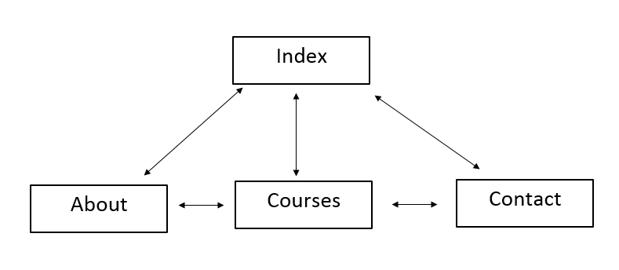

# CTEC3905_P15224656
### My Project

- I have used **HTML** to structure the web pages.
- **CSS** has been used to style the pages.
- Some **JAVASCRIPT** has been used to help my website have a smooth scroll when a button is clicked, and to display the content in the first navigation bar when icon is clicked.
- **JAVASCRIPT** has also been used for the speech synthesis, and the use of google maps, additionally, some **JAVASCRIPT** has been used for helping to display and close the modal.
- My website has a countdown clock which is displayed in the contact page, I used some **JAVASCRIPT** to help me achieve this.
- My website has multiple pages and a sitemap is included - a link to the sitemap is included in the footer of the web pages
- The pages are responsive and the layout is mobile first and will change when screen size is increased, I used breakpoints to help me achieve this.
- I have added descriptive comments throughout the code.
- In the footer there is a link that sends the user to the **sitemap**.
- There are some **wireframes** in the [wireframe folder](wireframes) that shows how the layout will be in different screen sizes.
- I have also added a **test log** document and images of the **test log** in the [test-log folder](test-log).
- The HTML and CSS is fully validated and there are no errors.
- The images I have used on my site are all from pexels.com which allows you to use free stock photos.

## Change of Design and Idea
- When designing the site at first I decided to have a one page scrollable site but as I was developing I then decided to change the structure to a multiple page site as I believe it would be easier for the user to be able to locate the content.

## Use of JavaScript Speech Synthesis
- I used the speech synthesis in javascript to allow users that might have visual impairment to be able to listen to the text being read.
- Users can do this by clicking on the speech buttons which are placed below the text in the home and about pages.
- Once the user does this a modal will display and the user can click on the speech button to start playing the text being read, they can also click on the stop button to stop the speech being played.

## Navigation Plan
- Below is an image of the navigation plan of my website.

